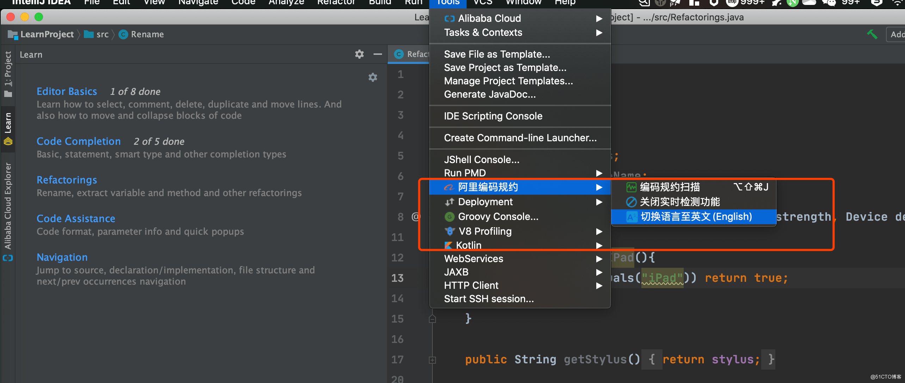
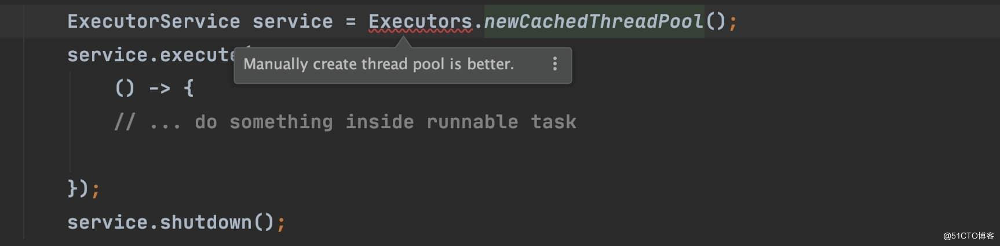

> 文中使用的 IDEA 版本是 IntelliJ IDEA 2021.2，其他版本也都是类似的。

大家好，我是 Guide!

昨晚刷到一篇知乎 370 多点赞的 IDEA 高效使用教程，带着好奇心，点击去一看，好家伙，又是盗用别人原创为自己引流的恶心行为。

让我纳闷的是，这篇文章的内容质量非常差，而且内容已经过时了（原文是 2018 年写的），竟然还能获得 370 多点赞。我自己非常多文章别人盗发几百点赞，我自己发个位数的点赞，就很奇葩，说多了都是泪......

于是，我利用昨天晚上和早起的这会时间总结了这篇 **IDEA 高效使用教程** 。希望对大家有帮助！

## 高效设置

我们先来讲讲有哪些设置调整之后 IDEA 会更好用。先说明一点: **这里只是根据我个人喜好和习惯的建议，IDEA 的默认配置已经很好用了，具体要不要修改还是要看个人喜好和习惯了。**

### 调整窗口字体显示大小

巨好用的一个功能！强烈安利！

勾选上 _Preferences / Settings | Editor | General_ 下的 _Change font size with Command + Mouse Wheel_ 选项之后，我们就可以直接使用 `⌘+鼠标滚轮`（Mac）/ `Ctrl+鼠标滚轮`(Windows&Linux)来更改窗口字体的大小


### 字体设置

修改 _Preferences / Settings | Editor | Font_ 选项下的字体设置，字体推荐使用 JetBrains Mono ，字体大小建议 16/18，根据个人需要选择是否需要开启连字。


连字开启之后，代码可读性会更强。


### 配置类注释模板

修改 _Preferences / Settings | Editor | File adn Code Templates_ 下的 `Class` 和 `Enum` 的模板。


我的日常项目的类注释模板配置为:

```java
/**
 * 微信搜 JavaGuide 回复"面试突击"即可免费领取个人原创的 Java 面试手册
 * @author Guide哥
 * @date ${YEAR}/${MONTH}/${DAY} ${HOUR}:${MINUTE}
 **/
public class ${NAME} {
}
```

### 优化 Live Templates

IDEA 自带的编码模板我们平时在编码的时候就会经常用到，不知道大家有没有注意。就比如说你输入一个 `sout` 就可以直接输出一行输出语句 `System.out.println();` 。


你可以根据自己的习惯对 IDEA 自带的编码模板进行修改，并且，你还可以添加新的编码模板来提高编码速度。非常使用！

### 全局设置 SDK

修改 _File -> New Projects Setup -> Structure...| Project_ 下的 Project SDK 选项，将其更改为你最常用的 Java 版本。


这样的话，你新导入的项目或者新建的项目都会默认使用这个版本的 SDK。

### 自动导包&删除无用包

勾选上 _Preferences / Settings | Editor | General | Auto Import_ 下的指定选项即可！


这样设置之后，IDEA 会自动帮你导包（唯一确定的时候才会生效）以及删除代码中没用到的包。

### 显示方法分割线

勾选上 _Preferences / Settings | Editor | General | Appearance_ 下的 Show method separators 选项之后，方法分割线就有了，这会小幅提高代码的可读性。


### 显示某个文件的提交记录

在界面左侧空白区域邮件，勾选上 _Annotate with Git Blame_ 即可显示对应文件详细代码提交记录，包括提交信息、提交人、变更文件等信息，非常强大！


## 必备插件

好用的插件太多了，我这里只推荐 6 个我最常用的 IDEA 插件。更多插件推荐可以看 [IDEA 必备插件专题](https://idea.javaguide.cn/plugins/)。

### jclasslib: 字节码查看神器

使用 `jclasslib` 不光可以直观地查看某个类对应的字节码文件，还可以查看类的基本信息、常量池、接口、属性、函数等信息。


### Tabnine: 基于 AI 的代码提示

Tabnine 的前身是大名鼎鼎的 Codota。我一直在用的一个插件，可以说非常好用了。

Tabnine 这个插件用于智能代码补全，它基于数百万 Java 程序，能够根据程序上下文提示补全代码。Tabnine 和 IDEA 自带的智能提示两者互补。

如果你觉得 IDEA 插件安装的太多比较卡顿的话，不用担心！Tabnine 插件还有一个对应的在线网站，在这个网站上你可以根据代码关键字搜索相关代码示例，非常不错！网站地址: https://www.tabnine.com/ 。


### Key Promoter X:快捷键提示

这个插件的功能主要是**在你本可以使用快捷键操作的地方提醒你用快捷键操作。**

举个例子。我直接点击 tab 栏下的菜单打开 Version Control(版本控制) 的话，这个插件就会提示你可以用快捷键 `command+9`或者`shift+command+9`打开。如下图所示。


它还可以展示出哪些快捷键你忘记使用的次数最多！


### Alibaba Java Code Guidelines: 阿里巴巴 Java 代码规范

阿里巴巴 Java 代码规范，对应的 Github 地址为: [https://github.com/alibaba/p3c (opens new window)](https://github.com/alibaba/p3c) 。非常推荐安装！

安装完成之后建议将与语言替换成中文，提示更加友好一点。



根据官方描述:

> 目前这个插件实现了开发手册中的的 53 条规则，大部分基于 PMD 实现，其中有 4 条规则基于 IDEA 实现，并且基于 IDEA [Inspection (opens new window)](https://www.jetbrains.com/help/idea/code-inspection.html)实现了实时检测功能。部分规则实现了 Quick Fix 功能，对于可以提供 Quick Fix 但没有提供的，我们会尽快实现，也欢迎有兴趣的同学加入进来一起努力。 目前插件检测有两种模式: 实时检测、手动触发。

上述提到的开发手册也就是在 Java 开发领域赫赫有名的《阿里巴巴 Java 开发手册》。

这个插件会实时检测出我们的代码不匹配它的规则的地方，并且会给出修改建议。比如我们按照下面的方式去创建线程池的话，这个插件就会帮我们检测出来,如下图所示。



### SequenceDiagram: 一键生成时序图

**通过 SequenceDiagram 这个插件，我们一键可以生成时序图。** 并且，你还可以:

1. 点击时序图中的类/方法即可跳转到对应的地方。
2. 从时序图中删除对应的类或者方法。
3. 将生成的时序图导出为 PNG 图片格式。


### Save Actions: 优化文件保存

这个插件可以帮助我们在保存文件的时候:

1. 优化导入；
2. 格式化代码；
3. 执行一些 quick fix
4. ......

这个插件是支持可配置的，我的配置如下:


## 主题优化

在[这几款 IDEA 主题也太好看了吧！！](../plugins/themes.md)这篇文章中，我精选了几个比较适合 Java 编码的 IDEA 主题供小伙伴们选择（我自己用的是 One Dark theme 这款）。


挺难受的，本着一片好意发这篇文章，结果还被喷了，很多小伙伴说我审美不行，还有一些小伙伴说花里胡哨的，没有原本自带的主题好看。

萝卜白菜各有所爱吧！保持一个包容的心态不是很难吧？你可以不装任何插件，但不要认为别人装插件就是多余，IDEA 的插件就是 IDEA 的一大灵魂所在，这点事无法否认的事实。

## 必备技巧

### 源码阅读

在 [真香！用 IDEA 神器看源码，效率真高！](./source-code-reading-skills.md) 这篇文章中，我介绍了自己平时看源码的时候常用的快捷键/小技巧！非常好用！


掌握这些快捷键/小技巧，使用 IDEA 看源码的效率提升一个等级！

### 快速创建包/文件夹

Java中的包是一种组织类和接口的机制，用于将相关的类和接口组织在一起。日常开发时，我们想要新建 Java 类时，考虑到项目的包目录划分可能需要新建一个包。

在 IDEA 中创建 Java 类时，是可以直接顺带创建包目录的，具体操作如下。

在创建 Java 类时，直接写出包目录名称通过 `.` 拼接即可，如下图新建 Java 类时填上 `com.example.helloworld`，


快速创建文件夹的方式跟快速创建包目录差不多，只不过将 `.` 拼接改为 `/` 即可，如下图新建文件时填上 `folder/new-folder`，


### 快速复制类代码生成 Java 类

对于完整的类代码，我们直接复制粘贴到包下即可生成对应的 Java 类，不需要再手动创建对应的类。

假如我们要把下面的类复制到项目里的话：

```java
public class MyClass {
    int aInteger;
    double bDouble;

    public MyClass(int myAIntegerParam, double myBDoubleParam) {
        aInteger = myAIntegerParam;
        bDouble = myBDoubleParam;
    }
}
```

直接复制然后再对应包下粘贴即可：


### 多实例启动

日常开发过程中，我们可能需要用到多实例启动，也就是在本地同时启动多个同一服务。

Run=> Edit Configurations=> 选中项目=> 选中“Allow parallel run”。


这是2022之前版本的方法，2022及之后的版本方式有所改变。

Run=> Edit Configurations=> 选中项目=> “Build and run”栏=> Modify Options=> 选中“Allow multiple instances”


